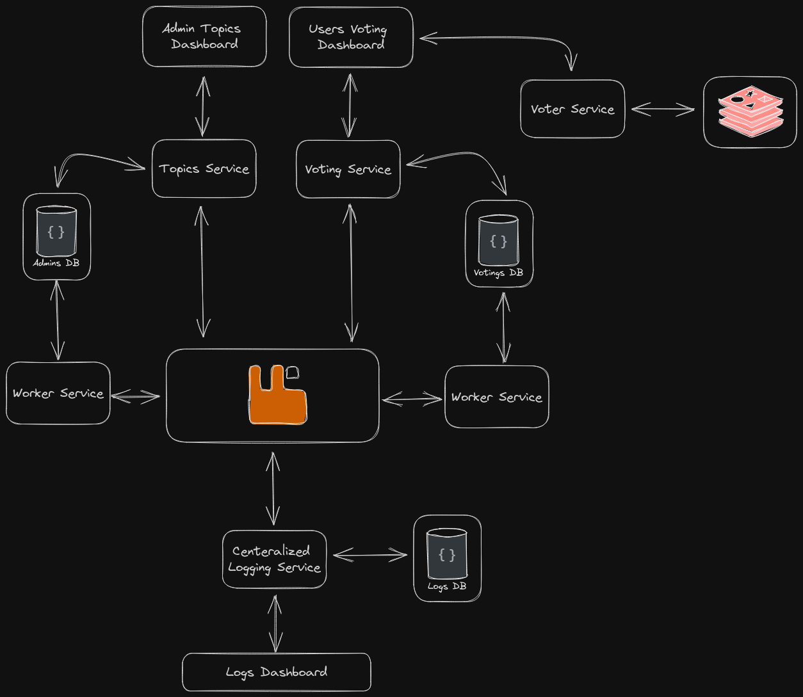

# Microservices Voting System

## Description

This is a simple microservices voting system. It is composed of 3 microservices:

- **Voters Service**: A service that allows users to vote between multiple options.
- **Admin Service**: A service that allows an admin to create a new vote.
- **2x Worker Services**: A service that allows to count the votes and to get the results.
- **Centeralized Logging Service**: A service that allows to log all the requests and responses of the other services.

## Architecture

## Services

- **Voting Service**
    - **Description**: A service that allows users to vote between multiple options.
    - **Port**: 8080
    - **Endpoints**:
        - **POST** `/votes`: Create a new vote.
        - **GET** `/votes/{voteId}`: Get a vote by id.
        - **GET** `/votes/{topicId}/` : Get all the votes for a topic.
        - **GET** `/votes/{topicId}/{voterId}`: Get a vote for a topic by a voter.
        - **PATCH** `/votes/{voteId}`: Update a vote by id.
        
- **Topics Service**
    - **Description**: A service that allows an admin to create a new vote, manage topics, voters, votes, and results.
    - **Port**: 8081
    - **Endpoints**:
        - **GET** `/topics`: Get all the topics.
        - **GET** `/topics/{topicId}`: Get a topic by id.
        - **GET** `/topics/{topicId}/results`: Get the results for a topic.
        - **PATCH** `/topics/{topicId}`: Update a topic by id.
        - **DELETE** `/topics/{topicId}`: Delete a topic by id.
        - **POST** `/topics`: Create a new topic.
        - **GET** `/topics/exists`: Check if a topic exists.

- **Voters Service**
    - **Description**: A service that allows to create a user and get an id to vote, and validates users ids for other services.
    - **Port**: 8082
    - **Endpoints**:
        - **POST** `/voters`: Create a new voter, and return the voter id.
        - **GET** `/voters/{voterId}`: Get a voter by id, to validate the voter id.

- **Centeralized Logging Service**
    - **Description**: A service that allows to log all the requests and responses of the other services.
    - **Port**: 8083
    - **Endpoints**:
        - **GET** `/logs`: Get all the logs.
        - **GET** `/logs/{logId}`: Get a log by id.